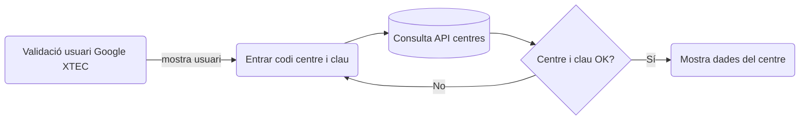

## Validació de l'usuari i de les dades del centre


---
Created with [Mermaid](https://mermaid.live/edit)

## Estructura de dades de l'usuari

```json
{
  "id": "123456789",
  "email": "fakeuser@xtec.cat",
  "verified_email": true,
  "name": "USUARI DE PROVA",
  "given_name": "USUARI",
  "family_name": "DE PROVA",
  "link": "https://plus.google.com/xxx",
  "picture": "https://lh3.googleusercontent.com/a/xxx",
  "locale": "ca",
  "hd": "xtec.cat"
}
```

## Estructura de les dades inicials
```json

{
  "status": "ok",
  "email": "correu@xtec.cat",
  "avatar": "https://lh3.googleusercontent.com/a/xxx",
  "fullUserName": "NOM DEL CENTRE",
  "actual": {
    "id": "01234567",
    "tipus": "ESC",
    "font": "Centre públic Dep. i CEB",
    "nom": "Escola Quatre Vents",
    "municipi": "Abella de Xerta",
    "sstt": "TEB",
    "ssttNou": "TEB",
    "enquesta": 1,
    "grups": 16,
    "pDepartament": 5,
    "pAltres": 1,
    "pTotal": 6,
    "e75paret": 0,
    "e75rodes": 0,
    "e65paret": 12,
    "e65rodes": 0,
    "eTotal": 12,
    "a75paret": 0,
    "a75rodes": 0,
    "a65paret": 11,
    "a65rodes": 0,
    "aTotal": 11,
    "apTotal": 16,
    "srFixes": 11,
    "srRodes": 0,
    "srTotal": 11,
    "asm": 5,
    "mad": 5,
    "public": 1,
    "maleta": 1,
    "max": 0
  },
  "resposta": {
    "idResposta": 5,
    "idCentre": "01234567",
    "timestamp": "2023-05-10 10:20:11",
    "user": "correu@xtec.cat",
    "estat": "OBERT",
    "grups": 16,
    "pDepartament": 5,
    "pAltres": 1,
    "mad": 5,
    "a75paret": 5,
    "a75rodes": 2,
    "a65paret": 4,
    "a65rodes": 0,
    "srFixes": 4,
    "srRodes": 0,
    "armGrans": 0,
    "armPetits": 0,
    "tablets": 0,
    "visDoc": 0,
    "altaveus": 0,
    "comentaris": "xxxx",
    "nomFitxer": "01234567_confirmacio_panells.pdf"
  }
}
```
